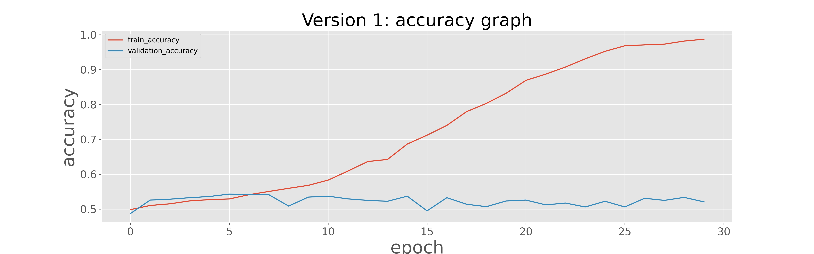
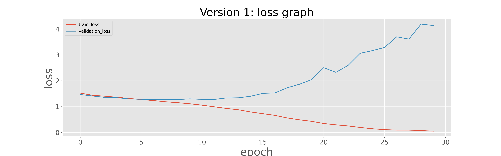

# Final Project - Bangkit JKT-1
> Google Bangkit final project JKT1-A


## File Owner
1. ODIR\_5K.ipynb > **Azhari**
2. Ocular\_Disease\_Recognition.ipynb > **Irfani**
3. Ocular\_Model\_[version].ipnyb > **Bima**

# Explanation
### Ocular Model Version 1 (Bima)
I used images that have explicit one label on it.

**Train and Validation Data:**

I splitted the data into train and validation data by 80% train and 20% validation

1. ```train_data``` = 4662 images belonging to 8 classes.
2. ```validation_data``` = 1166 images belonging to 8 classes

**Training parameter:**

1. ```learning_rate = 0.001```
2. ```optimizer = Adam```
3. ```epoch = 30```
4. Training time is +- 4 hours

**Neural Network Configuration**

```
model = tf.keras.models.Sequential([
    tf.keras.layers.Conv2D(16, (3,3), activation='relu', input_shape=(150, 150, 3)),
    tf.keras.layers.MaxPooling2D(2, 2),
    tf.keras.layers.Conv2D(64, (3,3), activation='relu'),
    tf.keras.layers.MaxPooling2D(2,2),
    tf.keras.layers.Conv2D(128, (3,3), activation='relu'),
    tf.keras.layers.MaxPooling2D(2,2),
    tf.keras.layers.Flatten(),
    tf.keras.layers.Dense(512, activation='relu'),
    tf.keras.layers.Dense(128, activation='relu'),
    tf.keras.layers.Dense(8, activation='softmax')
])
```

**Result:**

| model | loss | auc | accuracy | val\_loss | val\_auc | val\_accuracy |
| ----- | ----- | ----- | ----- | ----- | ----- | ----- |
| bima\_model_V1 | 0.0497 | 0.9994 | 0.9869 | 4.1342 | 0.8076 | 0.5206 |
| _<irfani_model>_ | 0.0 | 0.0 | 0.0 | 0.0 | 0.0 | 0.0 |
| _<azhari_model>_ | 0.0 | 0.0 | 0.0 | 0.0 | 0.0 | 0.0 |

**Graphic Result**

Accuracy Vs Epochs [BIMA] (hover to see title text):


Loss Vs Epochs [BIMA] (hover to see title text):

